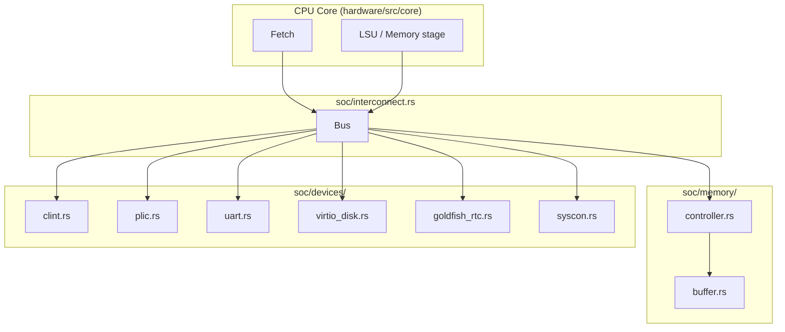

# SoC Integration

How the system-on-chip is built and how devices connect to the bus.

**Source:** `hardware/src/soc/`

---

## Overview

The SoC has an **interconnect** (bus) that routes CPU read/write requests by address to either main memory (DRAM) or an MMIO device. The bus is implemented as a list of devices sorted by base address; **find_device(addr)** returns the device covering that address. Memory and devices implement a **Device** trait (address range, read/write, tick, IRQ). The CPU issues fetches and loads/stores that are serviced by the interconnect; the interconnect forwards to the matching device or RAM.

---

## Flow (Mermaid)

---

## Bus (`interconnect.rs`)

- **Bus** holds a `Vec<Box<dyn Device + Send + Sync>>`, `width_bytes`, `latency_cycles`. Devices are sorted by base address.
- **add_device(dev):** Pushes a device and re-sorts; sets `ram_idx` and `uart_idx` by name ("DRAM", "UART0") for fast access.
- **load_binary_at(data, addr):** Writes bytes at address (finds device by address or falls back to byte writes).
- **tick():** Calls `tick()` on each device; returns timer IRQ and active IRQ bitmap (e.g., for CLINT and PLIC).
- **read_u8/u16/u32/u64**, **write_u8/...** (and similar): Resolve address via **find_device(addr)** and dispatch to the device’s read/write. **calculate_transit_time(bytes)** returns latency based on bus width and latency.

---

## Memory (`memory/`)

- **controller.rs:** Main memory controller: accepts read/write, applies DRAM timing (tRAS, tCAS, tPRE, row buffer).
- **buffer.rs:** Row/line buffer for DRAM modeling.
- **mod.rs:** Wires controller and buffer; exposes the DRAM device with name "DRAM" and the configured address range (e.g., from system config `ram_base`, `ram_size`).

---

## Builder (`builder.rs`)

Constructs the **System**: creates the bus, adds memory and each device with their base addresses and sizes, and wires interrupts (e.g., PLIC → CPU). Default address map is driven by config (e.g., `ram_base` 0x8000_0000, `uart_base` 0x1000_0000, `clint_base` 0x0200_0000, `disk_base` 0x9000_0000, etc.). See Python **SystemConfig** in [configuration](../python/configuration.md) for the corresponding fields.

---

## Devices

| Device   | File              | Role |
|----------|-------------------|------|
| **CLINT**| `devices/clint.rs` | Core Local Interruptor: timer (mtime/mtimecmp) and software interrupt (IPI). |
| **PLIC** | `devices/plic.rs`  | Platform-Level Interrupt Controller: aggregates device interrupts for the CPU. |
| **UART** | `devices/uart.rs` | Serial port (e.g., 16550-compatible); kernel console, output to host. |
| **VirtIO**| `devices/virtio_disk.rs` | Block device for disk image (rootfs); VirtIO MMIO. |
| **goldfish_rtc** | `devices/goldfish_rtc.rs` | RTC for guest time. |
| **syscon** | `devices/syscon.rs` | System control registers. |

Each device implements **Device** (name, address_range, read, write, tick, get_irq_id). The bindings expose **PyUart**, **PyPlic**, **PyVirtioBlock** for Python when needed.

---

## Traits (`traits.rs`)

The **Device** trait defines the interface for bus slaves: address range, read/write by offset, tick for timers/IRQs, and optional IRQ id. All memory and MMIO devices implement this so the interconnect can dispatch uniformly.

---

## See also

- [Hardware crates](hardware_crates.md) — where soc fits.
- [Bindings](bindings.md) — how Python drives the system (kernel boot).
- [Pipeline](../../architecture/pipeline.md) — how fetch/memory reach the interconnect.
