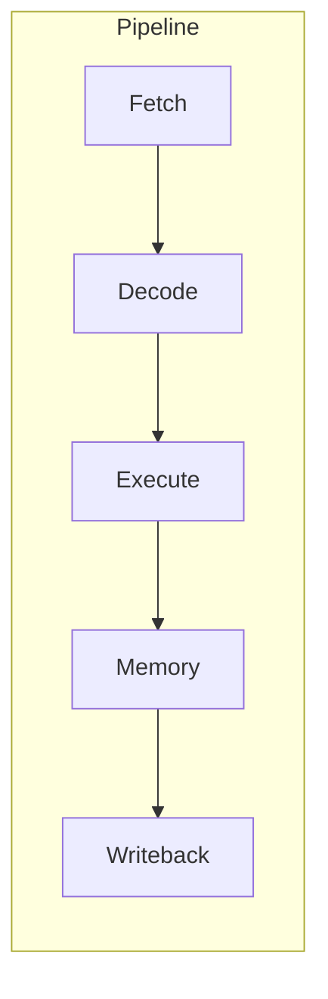
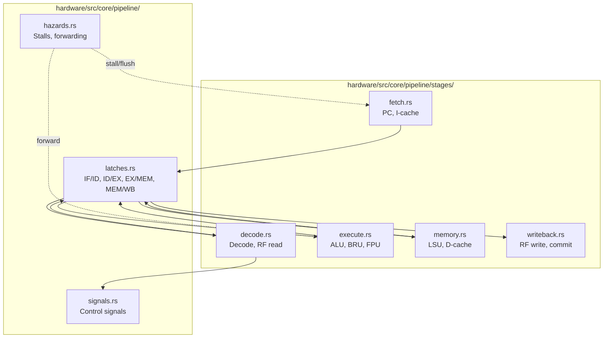

# Pipeline Architecture

This document describes the 5-stage in-order pipeline implemented in the RISC-V simulator core.

**Source:** `hardware/src/core/pipeline/`

---

## Overview

The pipeline consists of five stages: **Fetch**, **Decode**, **Execute**, **Memory**, and **Writeback**. Inter-stage state is carried by latch structures (IF/ID, ID/EX, EX/MEM, MEM/WB). Hazard detection and forwarding are in a dedicated module; decode generates control signals used by later stages.

---

## Stage Implementations

### 1. Fetch (`stages/fetch.rs`)

- Computes next PC (sequential or from branch predictor/BTB).
- Issues instruction fetch to I-cache/memory.
- Produces **IfIdEntry** for the IF/ID latch: `pc`, `inst` (32-bit, expanded from compressed if needed), `inst_size` (2 or 4 bytes), `pred_taken`, `pred_target`, and optional fetch-time `trap`.

### 2. Decode (`stages/decode.rs`)

- Decodes the instruction using `hardware/src/isa/decode.rs`.
- Reads architectural registers (GPR/FPR) and prepares operands.
- Produces **IdExEntry** for the ID/EX latch: `pc`, `inst`, `inst_size`, `rs1`/`rs2`/`rs3`, `rd`, `imm`, `rv1`/`rv2`/`rv3`, and **ControlSignals** for ALU, LSU, and writeback.

### 3. Execute (`stages/execute.rs`)

- Performs ALU operations (`units/alu.rs`), branch resolution (`units/bru/`), and FP ops (`units/fpu.rs`).
- Resolves branches (taken/not-taken, target); on misprediction the pipeline is flushed and fetch is redirected.
- Produces **ExMemEntry** for the EX/MEM latch (address, data, control, etc.).

### 4. Memory (`stages/memory.rs`)

- Handles load/store via LSU (`units/lsu.rs`), D-cache and MMU/TLB (`units/mmu/`, `units/cache/`).
- Produces **MemWbEntry** for the MEM/WB latch (result value, destination, control).

### 5. Writeback (`stages/writeback.rs`)

- Writes result to the register file (GPR/FPR) or CSRs.
- Updates commit/retire state and statistics.

---

## Latch Structures (`latches.rs`)

| Latch   | Entry type   | Carries |
|---------|---------------|---------|
| IF/ID   | `IfIdEntry`   | PC, instruction word, size, branch prediction, fetch trap |
| ID/EX   | `IdExEntry`   | PC, inst, rs1/rs2/rs3, rd, imm, rv1/rv2/rv3, control signals |
| EX/MEM  | `ExMemEntry`  | Address, store data, load/store control, ALU result, rd, etc. |
| MEM/WB  | `MemWbEntry`  | Result value, destination register, writeback control |

Entries support multiple in-flight instructions for superscalar width; the pipeline width is set by configuration.

---

## Supporting Modules

| Module  | Path                    | Purpose |
|---------|-------------------------|---------|
| Latches | `pipeline/latches.rs`  | IF/ID, ID/EX, EX/MEM, MEM/WB register slices between stages. |
| Hazards | `pipeline/hazards.rs`  | Data and control hazards, stalls, flushes, forwarding. |
| Signals | `pipeline/signals.rs`  | Control signals produced at decode for ALU, LSU, writeback. |
| Traits  | `pipeline/traits.rs`   | Common traits for pipeline stage components. |

## Future Architecture

- **TODO: Out-of-Order (OoO) Execution**  
  Future plans include implementing an out-of-order execution core with register renaming, reorder buffer (ROB), and unified/distributed reservation stations.

---

## See also

- [Branch prediction](branch_prediction.md) — BTB and predictors used in fetch and execute.
- [Memory hierarchy](memory_hierarchy.md) — caches and MMU used in fetch and memory stages.
- [ISA support](isa_support.md) — instruction decoding and extensions.
